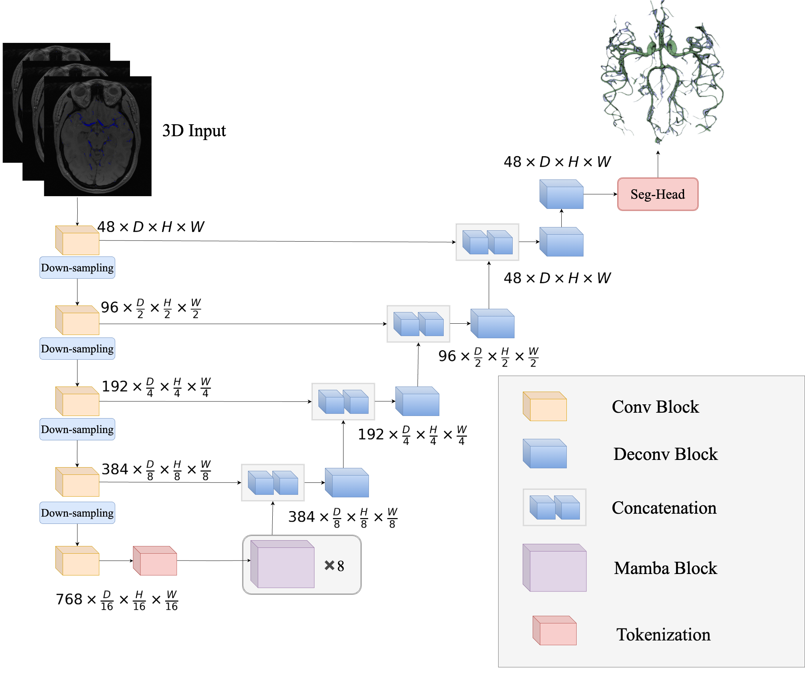

# README

# MambaVesselNet

MambaVesselNet: a Hybrid CNN-Mamba model for 3D cerebrovascular segmentation. 



## Dataset

This study uses the publicly available datasets related to cerebrovascular segmentation. Accessible at [https://xzbai.buaa.edu.cn/datasets.html](https://xzbai.buaa.edu.cn/datasets.html). 

## Contact

If you have any questions about our project, feel free to contact me by email at [scyyc15@nottingham.edu.cn](mailto:scyyc15@nottingham.edu.cn) or [Yanming0117@outlook.com](mailto:Yanming0117@outlook.com) 

## Environment install

### Install casual-conv1d

please make sure the cuda version ≥ 11.6

```bash
cd casual-conv1d
python setup.py install
```

### Install Mamba

```bash
cd mamba
python setup.py install
```

### Install MONAI

```bash
pip install monai
```

## Acknowledgements

This project is implemented using the 

[https://github.com/Project-MONAI/MONAI](https://github.com/Project-MONAI/MONAI)

Part of the code is based on

[https://github.com/ge-xing/SegMamba](https://github.com/ge-xing/SegMamba)
